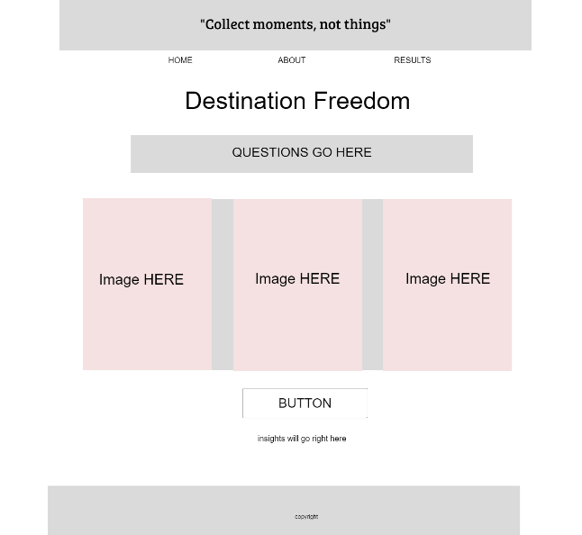
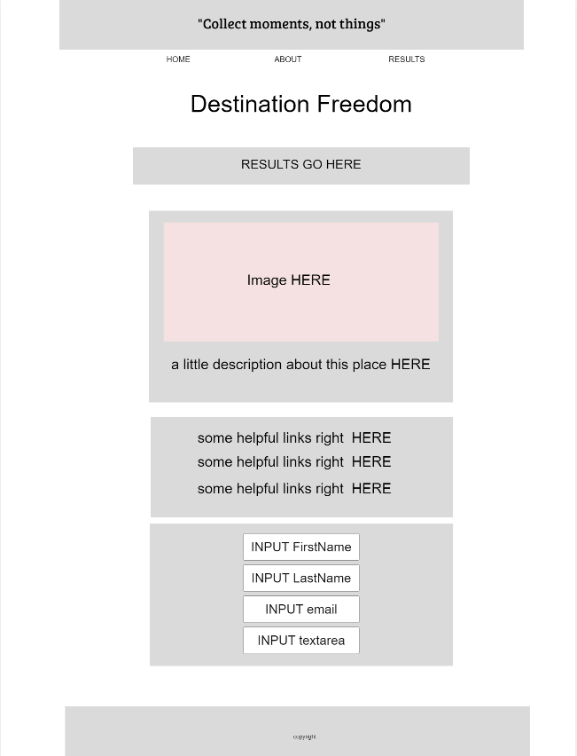
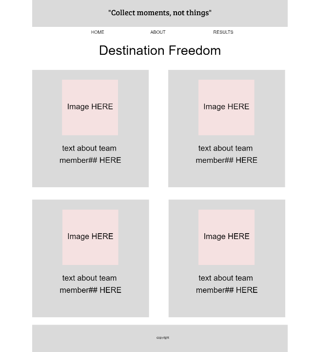
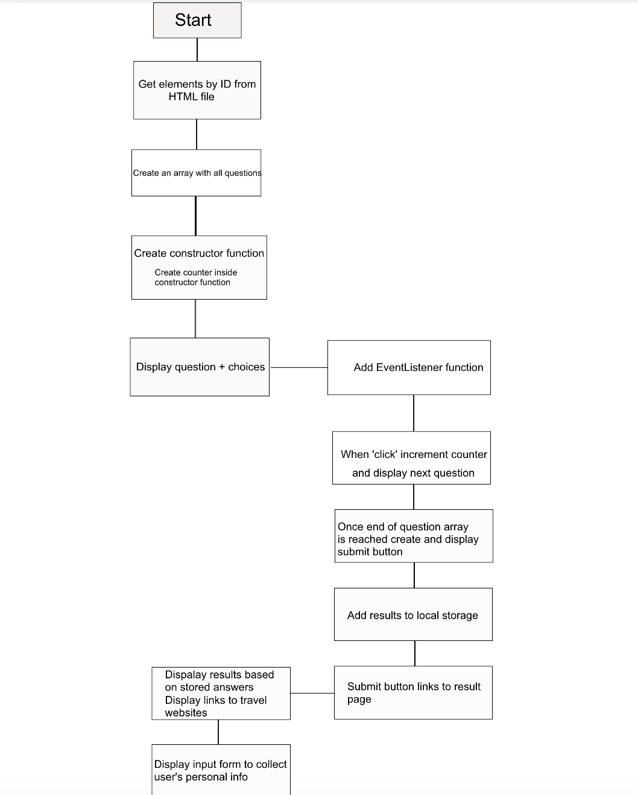

## Team :
1. Fizzo Pannosch 
2. James Shreckengost
3. Connor Curtis
4. Yuliya Barysevich 

## Description 

Our app can help people decide where they want to take a vacation to.
Helps you pick a travel destination depending on your preferences. Offers a large variety of destinations for users to pick from. For example: if you prefer winter activities, you might be suggested to a ski resort.
That's a three page app that takes the user through a quiz to determine potential travel destinations. With a home page, quiz page, and an 'about us' page.

## Wireframes 

## User Stories

1. As a user, I want a picture based interactive quiz application that can help me to decide where I can spend vacation.

2. As a user, I want the ability to choose from outdoor activities by selecting pictures.
    - To determine which activity to choose.
    - The chosen outdoor activity with description.

3. As a user, I want the ability to choose food destination from selecting pictures.
    - To determine what to eat.
    - The choosen food with description

4. As a user, I want to have opportunity to go to related website where I can buy tickets or book a hotel.

5. As a user (college student), I want to travel on a budget so that I can go on a vacation without worrying about the expenses. I want an app to account for some of my preferences and then display locations for me to potentially choose from based on what I liked.
    - To determine which destination to choose.
    - The chosen travel destination on a budget. 

6. As a user, I want to be guided to destinations that suit my style of activities.
    - To determine how to spend my time.
    - The chosen travel destination that corresponds to my answers  

## Domain Modeling 

